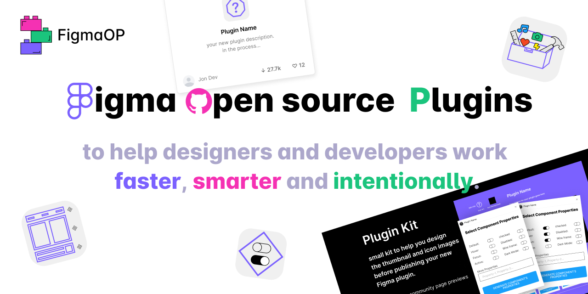

# FigmaOP:

To Help Designers And Developers Work
Faster, Smarter And Intentionally.

FigmaOp is a project dedicated to creating simple but effective tools to help with the day-to-day tasks of designers and developers. one of the main goals of this project is to allow junior developers to give back to the community by building small-scale applications with open source in mind; the best way to learn is to build and what is better than making something that people can actually use?!

[FigmaOP Site](https://figmaop.netlify.app/)

## Plugins:

-  [Fast Variants Properties](https://github.com/TalmSnir/FigmaOP-open-source-Figma-plugins/tree/main/Fast%20Variants%20Properties)
   
-  [Layout Handoff](https://github.com/TalmSnir/FigmaOP-open-source-Figma-plugins/tree/main/Layout-Handoff)
   
-  [Icons Toolbox](https://github.com/TalmSnir/Figma-Plugins/tree/main/Fast%20Variants%20Properties)

## License

[MIT LicenseD](https://github.com/tterb/atomic-design-ui/blob/master/LICENSEs)
